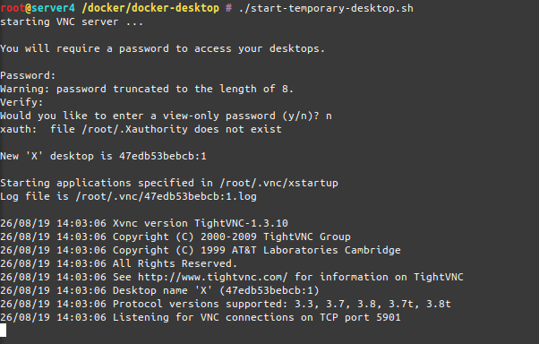

# Throw-Away Linux Desktop in a Docker Container

This container image is based upon Ubuntu 18.04 and creates a simple container with a Mate desktop environment and some tools installed.

It is meant for small-scale shared work by also exposing the desktop over VNC.

## building

run the build.sh script

## running

run the docker-desktop-temporary.sh script

When the container is closed all it's data will be "thrown away" and thus is not persistent. If you want it to become persistent please
read in the advanced section below.

As the temporary container starts up it will ask for a VNC password and additional just-view password. You can then connect to the 
desktop with a VNC client of your choice and the password on port 5901 (default vnc).

## advanced

Extract the root-home.tar.gz folder to a directory of your choice. Start the container alike the docker-desktop-temporary.sh script
does but add the folder you've extracted the root-home.tar.gz to to the -v mountings of the docker run command and mount it to /root.

